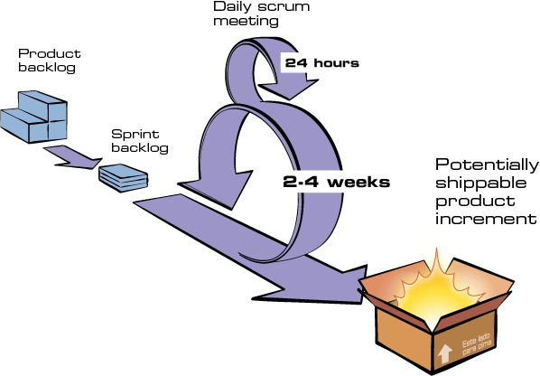
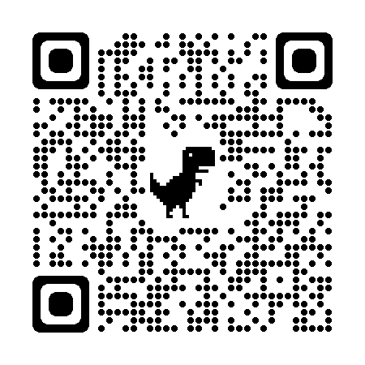

import { Head } from 'mdx-deck';
import { future } from 'mdx-deck/themes';
// import Code from './Code';

export const theme = future;

<Head>
  <link rel="preconnect" href="https://fonts.googleapis.com" />
  <link rel="preconnect" href="https://fonts.gstatic.com" crossorigin />
  <link
    href="https://fonts.googleapis.com/css2?family=Nunito:wght@400;500;700&display=swap"
    rel="stylesheet"
  />
  <link href="https://fonts.cdnfonts.com/css/cascadia-code" rel="stylesheet" />
  <title>Setor de projetos - Comp Júnior</title>
</Head>

# Bom momento!

---

# O que o setor de projetos faz?

- back end (servidor)
- front end (cliente)
- infraestrutura
- mobile
- PO

---

# Fluxo de um projeto

- prospecção > análise da viabilidade > doc de requisitos > contrato fechado

---

# início do projeto

- concepção e design

## desenvolvimento

- [Diagrama ER](https://www.lucidchart.com/pages/pt/o-que-e-diagrama-entidade-relacionamento)
- [Diagrama de sequência](https://www.lucidchart.com/pages/pt/o-que-e-diagrama-de-sequencia-uml)

---

# Documentação (de novo?)

---

> _Mês passado eu e Deus entendíamos o código, hoje só Deus..._

---

# Como documentamos

- GitHub
  - versionamento
  - [conventional commits](https://www.conventionalcommits.org/pt-br/v1.0.0/)
- GitHub Projects
  - Kanban

---

# Scrum

- "O Scrum é uma estrutura ágil de gestão de projetos que ajuda as equipes a estruturar e gerenciar o trabalho por meio do conjunto de valores, princípios e práticas" - [Atlassian](https://www.atlassian.com/br/agile/scrum)

---

# Gerências

- Diretor de projetos
  - Planejamento estratégico
  - Identifica a viabilidade de novos projetos
  - Trazer/Avaliar novas tecnologias para a Comp
- Gerente de projetos
  - Organiza e direciona as squads
  - Garante a qualidade das entregas dos projetos

---

# Perguntas?

---

# Terminamos!

